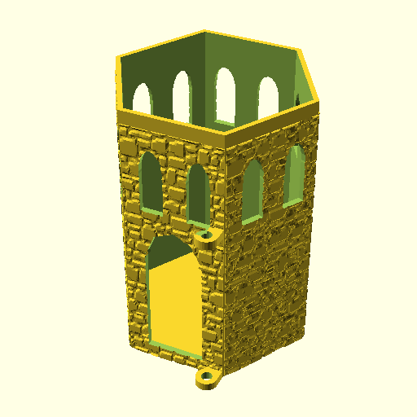

# Modellkatalog

Hier sind alle fertig als STL verfügbaren Modelle:

| Bild | Beschreibung | Datei |
|---|---|---|
|  | Turm mit einem Tor. Struktur mauer1.png | turm-m1.stl|
|  | Turm mit einem Tor. Struktur mauer2.png | turm-m2.stl|
|  | Turm mit einem Tor. Struktur mauer3.png | turm-m3.stl|
|  | Turm mit einem Tor. Struktur mauer4.png | turm-m4.stl|
|  | Zinnenkranz rechteckige Zinnen | zinnen-1.stl|
|  | Zinnenkranz Schwalbenschwanz Zinnen | zinnen-2.stl|
|  | Zinnenkranz geschwungene Zinnen | zinnen-3.stl|
|  | Torform 1 | tor-3.stl|
|  | Torform 2 | tor-2.stl|
|  | Bergfried Oberes Geschoß, Struktur mauer1.png | bergfried-1.stl|
|  | Bergfried Oberes Geschoß, Struktur mauer2.png | bergfried-2.stl|
|  | Bergfried Oberes Geschoß, Struktur mauer3.png | bergfried-3.stl|
|  | Mauer 1 | mauer1.stl|
|  | Mauer 2 | mauer2.stl|
|  | Mauer 3 | mauer3.stl|
|  | Langschiff mit Loch für Mast | langschiff.stl|
|  | Mast mit Segel | segel.stl|
|  | Belagerungsturm | belagerungsturm.stl|
|  | Schildkröte | schildkroete.stl|
|  | Onager | onager.stl|
